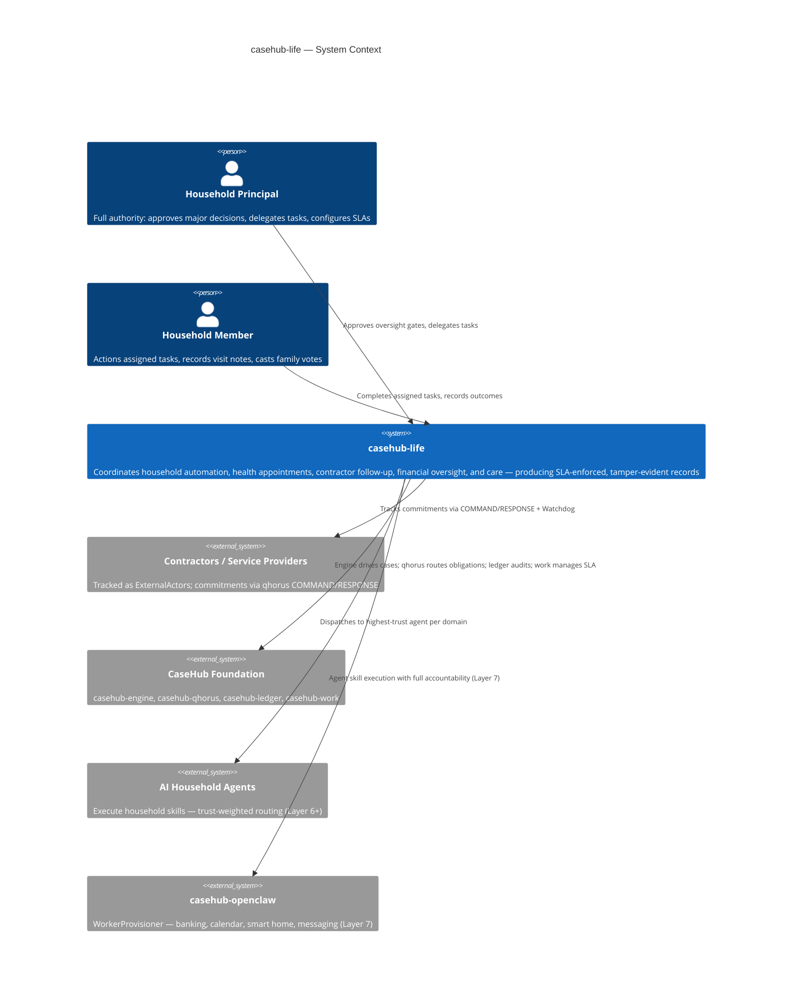
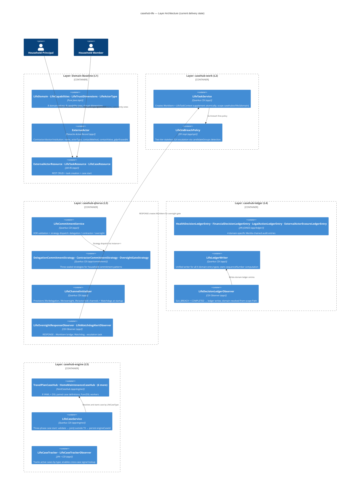
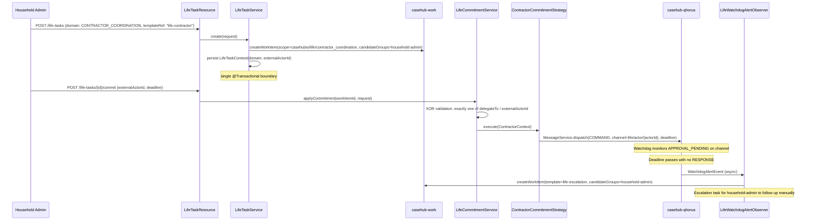
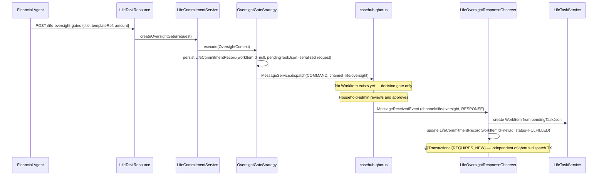
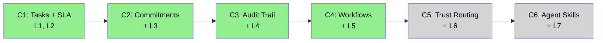

# casehub-life — ARC42STORIES.MD

**Spec:** Arc42Stories v0.1
**Profile:** CaseHub — Application tier
**Profile ref:** `../parent/docs/arc42stories-casehub-profile.md` · fallback: `https://raw.githubusercontent.com/casehubio/parent/main/docs/arc42stories-casehub-profile.md`
**Prefix:** LIF
**Status:** Layers 1–5 complete. Layers 6–7 stubs. Chapters C1–C4 complete; C5–C6 stubs.

---

## §1 Introduction and Goals

### Description

`casehub-life` is an **agentic harness for personal life automation** built on the CaseHub platform foundation. It coordinates household management agents, health coordination agents, financial governance agents, and elder/family care agents — producing a formally tracked, SLA-enforced, tamper-evident record of life obligations and decisions.

Personal life has domains where CaseHub's accountability properties are structurally required: contractor commitments go unfulfilled without a Watchdog, health follow-ups are forgotten without SLA enforcement, family obligations evaporate without commitment tracking, legal deadlines arrive without escalation.

The CaseHub foundation has no domain knowledge. It knows about cases, bindings, workers, commitments, trust, and audit. `casehub-life` provides the personal life domain logic: what a household task is, how a care coordination cycle proceeds, which family members have decision authority, and how a major financial decision requires human sign-off before action.

### Stakeholders

| Stakeholder | Interest |
|---|---|
| Household principal | Full authority: approve major financial decisions, delegate tasks, configure SLAs |
| Household members | Standard members: view all, action assigned tasks, request new tasks |
| Contractors / service providers | External actors tracked via ExternalActor entity; commitments via qhorus COMMAND/RESPONSE |
| AI household agents | Execute household skills with trust-weighted routing (Layer 6+) |
| CaseHub platform team | Validates foundation correctness under household automation requirements |

### Quality Goals

| Priority | Goal | Scenario |
|---|---|---|
| 1 | SLA-bounded contractor commitments | Plumber commits to Thursday — Watchdog fires if no ETA by deadline; escalation to household-admin |
| 2 | Formal obligation on verbal commitments | "I'll be there Thursday" tracked as a qhorus Commitment with COMMAND/RESPONSE/DONE lifecycle |
| 3 | Tamper-evident audit for major decisions | Health decisions, financial approvals, and legal actions produce Merkle-chained ledger entries |
| 4 | GDPR Art.17 erasure for contractor data | Contractor personal data erasable on request; erasure proof recorded in ledger |
| 5 | Multi-step workflow orchestration | Travel planning, care coordination, appointment cycles — adaptive gates and cross-case signals |

### Artifact Schema

PREFIX: `LIF`

| Artifact type | Format | Example | Where it lives |
|---|---|---|---|
| Improvement log entry | `LIF-NNN` | `LIF-042` | `docs/PROGRESS.md` |
| Issue | `#NNN` or `casehubio/life#NNN` | `#21`, `casehubio/life#21` | GitHub Issues |
| Garden entry | `GE-YYYYMMDD-XXXXXX` | `GE-20260601-8ff52b` | `~/.hortora/garden/` |
| Protocol | `PP-YYYYMMDD-XXXXXX` | `PP-20260527-da1f66` | `casehub-parent/docs/protocols/` |
| ADR | `ADR-NNNN` | `ADR-0001` | `docs/adr/` (project repo) |
| Blog entry | `YYYY-MM-DD-[initials]NN-title` | `2026-06-01-mdp01-layer5-eight-workflows` | workspace `blog/` |
| Design spec | `YYYY-MM-DD-topic-design` | `2026-05-31-layer5-casehub-engine-design` | `docs/specs/` (project repo) |

---

## §2 Constraints

### Platform

| Constraint | Value | Rationale |
|---|---|---|
| Java version | Java 21 (on Java 26 JVM) | Java 21 language features; JVM 26 for performance |
| Framework | Quarkus 3.32.2 | Ecosystem-wide version lock; bump all projects together |
| Native target | GraalVM 25 | Production native image target |
| Build tool | Maven (not `./mvnw`) | Wrapper not configured; use system `mvn` |

```bash
JAVA_HOME=$(/usr/libexec/java_home -v 26) mvn clean install
```

### Architectural

- **Production-first constraint:** Before writing any class, apply: "Would this class exist in a production system built to this layer and no further?" If no — do not build it.
- **Layering rule:** If a capability requires knowledge of household domains, health protocols, personal finance rules, or family obligation tracking, it belongs here. If it is purely about cases, commitments, trust, or audit records, it belongs in the foundation.
- **Two-module structure:** `api/` (pure Java, zero framework — enums, constants, request/response records) + `app/` (Quarkus app — JPA entities, REST, services, Flyway). Protocol: `module-tier-structure.md`.
- **Active Record exception:** No downstream JPA consumers exist for this application-tier repo. Panache Active Record entities in `app/` serve directly as domain objects. CDI displacement via `@DefaultBean` does not apply — each layer adds new services rather than displacing existing ones.

### Dependencies

All casehubio artifacts at `0.2-SNAPSHOT` resolved from GitHub Packages. The `casehub-parent` BOM owns version alignment. `casehub-life` may not commit to peer repo directories — each has its own Claude session.

---

## §3 Context and Scope



### Boundary Rules

**casehub-life owns:** household domain vocabulary (`LifeDomain` enum, capability tags, trust dimensions); workflow definitions (8 CasePlanModel YAMLs); SLA breach policy; commitment strategies (delegation, contractor, oversight); ledger entry subclasses for health/financial/legal decisions; GDPR erasure for contractor data; cross-case signal routing.

**Foundation owns:** case lifecycle (engine); agent communication mesh and obligation tracking (qhorus); Merkle audit chain (ledger); human task lifecycle and SLA (work).

See `../parent/docs/PLATFORM.md` Capability Ownership table for the full boundary map.

---

## §4 Solution Strategy

### Core Architectural Patterns

| Tier | Pattern blend | Life expression |
|---|---|---|
| Domain | **Hexagonal** | `api/` holds pure Java domain constants and records; `app/` holds all Quarkus wiring |
| Persistence | **Active Record (exception)** | No downstream JPA consumers; Panache entities serve as domain objects directly |
| Orchestration | **Event-Driven + ACM** | CDI async events chain layers; engine evaluates binding conditions against accumulated CaseContext |
| Cross-cutting | **Strategy + Observer** | `LifeCommitmentStrategy` sealed hierarchy; `LifeSlaBreachPolicy`; `@ObservesAsync` for ledger capture and case tracking |

### Layer Taxonomy

**Before L1:** no accountability, no SLA, no formal obligation, no audit trail.
**After L1–L5:** a `POST /life-tasks` call creates a WorkItem with an SLA deadline, a `POST /life-tasks/{id}/commit` dispatches a formal qhorus COMMAND with Watchdog follow-up, a `POST /life-cases` starts a multi-step CasePlanModel workflow with adaptive gates and cross-case signals — all producing tamper-evident ledger entries.

| Layer | Foundation module | Reading order | Build status |
|---|---|---|---|
| Domain Baseline | *(none — pure Java + Panache)* | L1 | ✅ complete |
| casehub-work | `casehub-work` | L2 | ✅ complete |
| casehub-qhorus | `casehub-qhorus` | L3 | ✅ complete |
| casehub-ledger | `casehub-ledger` | L4 | ✅ complete |
| casehub-engine | `casehub-engine` | L5 | ✅ complete |
| Trust routing | `casehub-ledger` (trust APIs) | L6 | 🔲 pending |
| casehub-openclaw | `casehub-openclaw` | L7 | 🔲 pending |

### Chapter Sequencing Rationale

- C1 before C2: WorkItem infrastructure (L2) required for commitment targets — qhorus COMMAND needs a task to commit on
- C2 before C3: qhorus channels (L3) produce `MessageLedgerEntry` records that enrich ledger audit — commitment decisions are the high-value audit events (soft ordering)
- C3 before C4: ledger (L4) provides tamper-evident capture of CasePlanModel decision points — CasePlanModel without audit is untracked (soft ordering)
- C4 before C5: workflow outcomes (L5) are the primary source of trust score signals — trust routing needs outcome data (hard ordering)
- C5 before C6: trust routing (L6) must be wired before OpenClaw dispatches agents — otherwise agents launch without trust weighting (soft ordering)

---

## §5 Building Block View

### Layer Architecture View

Current delivery state — Layers 1–5 complete. Layers 6–7 pending.



### Two-Module Structure

```
life/
├── api/     ← casehub-life-api   — pure Java: LifeDomain, LifeCapabilities, LifeTrustDimensions,
│              LifeActorType, LifeCaseType, LifeCaseStatus, request/response records.
│              Zero framework imports. No JPA.
├── app/     ← casehub-life       — Quarkus: JPA entities (ExternalActor, LifeTaskContext,
│              LifeCommitmentRecord, LifeCaseTracker), REST resources, Flyway (V100–V107),
│              services, SPI impls, commitment strategies, observers, engine (8 YamlCaseHub +
│              8 DSL companions + LifeCaseService + LifeCaseTrackerObserver),
│              ledger subclasses (io.casehub.life.app.ledger — qhorus PU),
│              YAML definitions (app/src/main/resources/life/).
└── pom.xml
```

---

## §6 Runtime View

### Scenario 1 — Contractor Commitment with Watchdog Follow-up

A household-admin creates a task, commits a contractor via COMMAND, and the Watchdog fires if no response arrives by deadline.



### Scenario 2 — Financial Oversight Gate with Deferred WorkItem

A major financial decision requires household-admin approval before any WorkItem is created.



---

## §7 Deployment View

```
Developer machine / CI:
  JAVA_HOME=$(/usr/libexec/java_home -v 26) mvn clean install
  → casehub-life-api.jar + casehub-life-runner.jar

  Install api first (Quarkus generate-code dependency):
    mvn install -pl api --batch-mode
  Then build app:
    mvn install -pl app --batch-mode
  Single-class test:
    mvn install -pl api --batch-mode && mvn test -pl app -Dtest=ClassName --batch-mode

Production target:
  GraalVM 25 native image (app/)
  Default datasource: PostgreSQL — life domain entities + casehub-work entities
  qhorus named datasource: PostgreSQL — qhorus entities + casehub-ledger entities + life ledger subclasses

Flyway migration ranges:
  V1–V31   casehub-work (from casehub-work JAR — do not use this range)
  V1–V9    casehub-qhorus (from casehub-qhorus JAR — do not use this range)
  V100–V107 life domain tables (default datasource, db/life/migration/)
  V1000–V1007 casehub-ledger base tables (from casehub-ledger JAR)
  V2100+   life ledger subclass join tables (qhorus datasource, db/life/ledger/migration/)

GitHub Packages:
  All casehubio/* artifacts at 0.2-SNAPSHOT
  Resolved via: <url>https://maven.pkg.github.com/casehubio/*</url>
  CI authentication: server-id: github + GITHUB_TOKEN
```

---

## §8 Crosscutting Concepts

### Governing protocols and references

| Concern | Protocol / Reference |
|---|---|
| Module tier structure (api / app) | `docs/protocols/universal/module-tier-structure.md` |
| Flyway migration naming, H2 compatibility | `docs/protocols/universal/flyway-migration-rules.md` |
| Flyway repo-scoped path (db/life/migration/) | PP-20260525-607b33 |
| Named datasources | `docs/PLATFORM.md §Persistence` |
| CDI displacement (`@DefaultBean`) | `docs/protocols/casehub/alternative-extension-patterns.md` — **does not apply to life** (Active Record, no displacement) |
| Domain supplement pattern | PP-20260527-da1f66 — LifeTaskContext attaches domain context to foundation WorkItem |
| REST resource conventions | PP-20260526-d0b921 — `@Blocking @ApplicationScoped`; class-level `@Produces`/`@Consumes` |
| `@Transactional` placement | PP-20260526-75d9c9 — service methods only, never resource methods |
| YAML + DSL case definition pairing | PP-20260518-case-definition-layers — both are equal authoring paths |
| FuncDSL worker execution | PP-20260531-worker-func-exec — `FuncWorkflowBuilder`, not raw lambdas |
| Three-phase case start | PP-20260529-3ffe28 — never join() inside @Transactional |
| Dual-trail audit | `dual-trail-audit-pattern.md` — operational (casehub-work/qhorus) vs compliance (casehub-ledger) |
| Auth retrofit readiness | `auth-retrofit-readiness.md` — auth not yet wired; design for retrofit |
| Post-generation quality gate | `docs/protocols/casehub/arc42stories-post-generation-quality-gate.md` |

### Security

`ExternalActor` is the sole entity holding PII (name, contactMethod, contactValue). GDPR Art.17 erasure: `DELETE /external-actors/{id}/personal-data` nullifies PII fields and writes `ExternalActorErasureLedgerEntry` as proof. Guards: 404 (not found), 409 (already erased), 409 (active tasks exist).

`@RolesAllowed` can be added to REST resources without structural change — auth-retrofit ready by design. `actorId` convention: `"life-system"` for system events, `"household-admin"` for GDPR erasure (until auth wired).

### Anti-patterns

- **Wrapper entities that duplicate foundation primitives**
  - **Symptom:** Domain model has `HouseholdTask` (wrapping WorkItem), `LifeGoal` (wrapping CaseInstance), `LifeEvent` (wrapping LedgerEntry). Duplicate fields everywhere — `title`, `deadline`, `status` exist in both wrapper and foundation entity.
  - **Cause:** Layer 1 built naive domain entities without understanding which fields the foundation already owns. The entities replicate foundation lifecycle state in a parallel data model.
  - **Fix:** Remove wrapper entities. Use foundation primitives directly with a domain supplement table (`LifeTaskContext`) carrying only fields with no foundation equivalent (`domain`, `externalActorId`, `recurrence`). See `docs/specs/2026-05-27-layer2-casehub-work-sla.md` and parent#79.

- **Ledger subclass in sub-package of default PU entity package**
  - **Symptom:** `AnnotationException: Association 'LedgerEntry.supplements' targets LedgerSupplement which does not belong to the same persistence unit`.
  - **Cause:** `io.casehub.life.app.entity.ledger` (sub-package of `io.casehub.life.app.entity`) is matched by Quarkus prefix-matching to the default PU. The ledger entity ends up in the default PU instead of the qhorus PU.
  - **Fix:** Place ledger subclasses in `io.casehub.life.app.ledger` (sibling, not child, of `io.casehub.life.app.entity`). List that package only under the qhorus PU config.

- **Engine memory @Alternative beans silently missing**
  - **Symptom:** Cases start via `CaseHubRuntime.startCase()` but no bindings fire. Case status stays RUNNING indefinitely. No error in logs.
  - **Cause:** `MemorySubCaseGroupRepository`, `MemoryPlanItemStore`, `MemoryReactivePlanItemStore` not listed in `quarkus.arc.selected-alternatives`. Engine falls back to no-op implementations.
  - **Fix:** Add all three to `quarkus.arc.selected-alternatives` in both `application.properties` and test `application.properties`.

- **CDI observer for CREATE fires before domain supplement persisted**
  - **Symptom:** `LifeDecisionLedgerObserver` writes no ledger entry for CREATE events. No error — the observer finds no `LifeTaskContext` for the workItemId.
  - **Cause:** `WorkItemLifecycleEvent` fires during `WorkItemService.create()`, before `LifeTaskContext.persist()` in the calling service. The observer's `LifeTaskContext.findByWorkItemId()` returns empty.
  - **Fix:** Direct service call for CREATE events (not CDI observer). CDI observer handles only SLA_BREACH and COMPLETED, which fire after the full transaction commits.

---

## §9.1 Journey Overview

| Journey | Description | Chapters | Status |
|---|---|---|---|
| Household Automation | Personal life coordination from naive domain through full CaseHub accountability | 6 | In progress |



---

## §9.2 Chapter Index

| # | Chapter | Journey | Layers touched | Delta summary | Status |
|---|---|---|---|---|---|
| 1 | Tasks + SLA | Household Automation | L1, L2 | High, High | ✅ |
| 2 | Commitments | Household Automation | + L3 | High | ✅ |
| 3 | Audit Trail | Household Automation | + L4 | High | ✅ |
| 4 | Workflows | Household Automation | + L5 | High | ✅ |
| 5 | Trust Routing | Household Automation | + L6 | Medium | 🔲 |
| 6 | Agent Skills | Household Automation | + L7 | High | 🔲 |

### Layer × Chapter Matrix

| Layer | C1 | C2 | C3 | C4 | C5 | C6 |
|---|---|---|---|---|---|---|
| L1 Domain Baseline | High | Low | — | — | — | — |
| L2 casehub-work | High | Low | Low | Low | Low | Low |
| L3 casehub-qhorus | — | High | — | Low | — | Low |
| L4 casehub-ledger | — | — | High | Low | — | — |
| L5 casehub-engine | — | — | — | High | — | Low |
| L6 Trust routing | — | — | — | — | Medium | Low |
| L7 casehub-openclaw | — | — | — | — | — | High |

L1 and L2 appear in every column — foundational cross-cutting responsibility. L3 and L4 stabilize after introduction (single High, then Low deltas). L5 introduces High in C4 and is expected to carry Low deltas in C6 (engine orchestrates OpenClaw workers).

### Sequencing Rationale

- C1 before C2: WorkItem infrastructure required for commitment targets — qhorus COMMAND needs a task to commit on
- C2 before C3: qhorus channels produce `MessageLedgerEntry` records that enrich ledger audit — commitment decisions are high-value audit events (soft ordering)
- C3 before C4: ledger provides tamper-evident capture of CasePlanModel decision points — CasePlanModel without audit is untracked (soft ordering)
- C4 before C5: workflow outcomes are the primary source of trust score signals — trust routing needs outcome data (hard ordering)
- C5 before C6: trust routing must be wired before OpenClaw dispatches agents — otherwise agents launch without trust weighting (soft ordering)

---

## §9.3 Chapter Entries

### Chapter 1 — Tasks + SLA

**Journey:** Household Automation | **Sequence:** 1 of 6 | **Status:** ✅
**Delivered:** 2026-05-27 | **Issues:** #2, #3

**What this delivers**

Life-domain tasks created against named WorkItemTemplates with SLA deadlines. Household-admin escalated automatically when deadlines breach. ExternalActor entity provides contractor/doctor identity with delete protection when tasks reference them.

**Accountability gaps closed**
- Contractor deadline passes silently → WorkItem + LifeSlaBreachPolicy (L2)
- No escalation path → ExpiryLifecycleService + two-tier breach policy (L2)

**Layer Impact**

| Layer | Delta |
|---|---|
| L1 Domain Baseline | High — 8 domain values, ExternalActor entity, REST API, Flyway V100–V103 |
| L2 casehub-work | High — LifeTaskService, LifeTaskContext supplement, LifeSlaBreachPolicy, templates V104–V106 |

---

### Chapter 2 — Commitments

**Journey:** Household Automation | **Sequence:** 2 of 6 | **Status:** ✅
**Delivered:** 2026-05-29 | **Issues:** #4

**What this delivers**

Contractor commitments tracked via COMMAND/RESPONSE with Watchdog follow-up. Family delegation requires acknowledged RESPONSE. Financial-oversight gates defer WorkItem creation — no task exists until household-admin approves.

**Accountability gaps closed**
- "Plumber committed Thursday" is a mental note → COMMAND on `life/actor/{id}` + Watchdog (L3)
- Family delegation has no enforcement → COMMAND to `life/delegation` with deadline (L3)
- Major financial decision proceeds without gate → COMMAND to `life/oversight`; WorkItem not created until RESPONSE (L3)

**Layer Impact**

| Layer | Delta |
|---|---|
| L3 casehub-qhorus | High — LifeCommitmentService, 3 strategies, LifeChannelInitializer, 2 observers, LifeCommitmentRecord entity |
| L1 Domain Baseline | Low — api/ commitment mode/status/outcome records |
| L2 casehub-work | Low — escalation template V104 for Watchdog alerts |

---

### Chapter 3 — Audit Trail

**Journey:** Household Automation | **Sequence:** 3 of 6 | **Status:** ✅
**Delivered:** 2026-05-30 | **Issues:** #5 | **Blog:** `blog/` — 🔲 no dedicated L4 blog

**What this delivers**

Health, financial, and legal decisions produce tamper-evident Merkle audit records. GDPR Art.17 erasure for contractor personal data — ExternalActor PII nullified with proof recorded in ledger.

**Accountability gaps closed**
- Health decision has no independently verifiable record → HealthDecisionLedgerEntry (L4)
- Financial approval can be disputed after the fact → FinancialDecisionLedgerEntry (L4)
- Legal action has no compliance record → LegalActionLedgerEntry (L4)
- Contractor personal data cannot be erased → ExternalActorErasureLedgerEntry + DELETE endpoint (L4)

**Layer Impact**

| Layer | Delta |
|---|---|
| L4 casehub-ledger | High — 4 LedgerEntry subclasses, LifeLedgerWriter, LifeDecisionLedgerObserver, GDPR erasure endpoint |
| L2 casehub-work | Low — observer handles SLA_BREACH and COMPLETED events from WorkItem lifecycle |

---

### Chapter 4 — Workflows

**Journey:** Household Automation | **Sequence:** 4 of 6 | **Status:** ✅
**Delivered:** 2026-06-01 | **Issues:** #6 | **Blog:** `2026-06-01-mdp01-layer5-eight-workflows.md`

**What this delivers**

Multi-step household workflows orchestrated via CasePlanModel — travel planning with parallel research and family vote, care coordination with SubCase episodes, contractor follow-up with qhorus bridge, financial review with cross-case signals. Eight case definitions demonstrate the full engine capability set.

**Accountability gaps closed**
- Household coordination is disconnected tasks → CasePlanModel workflow with binding conditions (L5)
- No adaptive routing based on context → adaptive gate bindings (isHighValue, requiresApproval) (L5)
- No formal quorum for shared decisions → M-of-N SubCase: 2-of-3 family vote (L5)
- No cross-case coordination → LifeCaseTracker + CaseHubRuntime.signal() (L5)

**Layer Impact**

| Layer | Delta |
|---|---|
| L5 casehub-engine | High — 8 YamlCaseHub + 8 DSL companions, LifeCaseService, LifeCaseTracker, 8 YAML definitions, V107 |
| L2 casehub-work | Low — scope retrofit to hierarchical path format (casehubio/life/{domain}) |
| L4 casehub-ledger | Low — LifeDecisionLedgerObserver adapted to resolve domain from scope Path |

---

### Chapter 5 — Trust Routing

**Journey:** Household Automation | **Sequence:** 5 of 6 | **Status:** 🔲
**Issues:** #7, #11

🔲 Full entry at C5 close. Blocked on Layer 6 implementation.

**Layer Impact**

| Layer | Delta |
|---|---|
| L6 Trust routing | Medium — trust dimension scores on ExternalActor, Bayesian Beta update from outcomes |

---

### Chapter 6 — Agent Skills

**Journey:** Household Automation | **Sequence:** 6 of 6 | **Status:** 🔲
**Issues:** #8

🔲 Full entry at C6 close. Blocked on Layer 7 implementation.

**Layer Impact**

| Layer | Delta |
|---|---|
| L7 casehub-openclaw | High — OpenClaw as WorkerProvisioner; banking, calendar, smart home, messaging skills |

---

## §9.4 Layer Entries

### Layer — Domain Baseline

**Participates in chapters:** C1, C2, C3, C4, C5, C6 *(foundation — all chapters build on it)*
**Architectural patterns:** Hexagonal (api/app split), Active Record (Panache)
**Key protocols:** `flyway-migration-rules.md`, `module-tier-structure.md`, PP-20260526-d0b921 (REST @Blocking @ApplicationScoped)
**Design refs:** `docs/specs/2026-05-26-layer1-domain-baseline.md`
**Issues:** casehubio/life#2
**Navigation:** `git log --grep="#2" --oneline`
**Blog:** `2026-05-26-mdp01-layer1-domain-baseline.md`
**Improvement refs:** 🔲
**Completed:** 2026-05-26 — `c43e2cf`

> **Redesign note (2026-05-27):** The Layer 1 entities `HouseholdTask`, `LifeGoal`, and
> `LifeEvent` were removed in Layer 2 — they duplicated foundation primitives (see
> `docs/specs/2026-05-27-layer2-casehub-work-sla.md` §Context and design pivot and parent#79).
> This entry documents the original Layer 1 baseline and the accountability gaps it showed.
> The Layer 2 spec describes the corrected domain model.

#### What it adds

**Before:** No domain vocabulary, no entities, no REST API.
**After:** Household domain vocabulary with `LifeDomain` enum (8 values), `ExternalActor` Panache entity, and REST API for actors and life-domain tasks — without SLA enforcement, commitment tracking, or audit.

The accountability gaps are structural: no record of who committed to what, no SLA enforcement, no formal obligation when a contractor commits to a date, no escalation when deadlines pass.

Not closed here: SLA enforcement (Layer 2), commitment tracking (Layer 3), tamper-evident audit (Layer 4), workflow orchestration (Layer 5).

#### Accountability gaps closed

| Gap | What breaks without it | Closed by |
|---|---|---|
| No SLA enforcement | Contractor task sits indefinitely | Layer 2 (casehub-work) |
| No commitment tracking | "Plumber committed to Thursday" is a mental note | Layer 3 (casehub-qhorus) |
| No tamper-evident audit | Health and financial decisions have no verifiable record | Layer 4 (casehub-ledger) |
| No formal obligation | "Pick up kids at 3:30" has no required RESPONSE, no Watchdog | Layer 3 (casehub-qhorus) |
| No escalation path | Missed task sits silently | Layer 2 (casehub-work) |

#### Key files

**api/ — pure Java, zero framework:**
- `api/src/main/java/io/casehub/life/api/LifeDomain.java` — enum: HOUSEHOLD, HEALTH, FINANCE, FAMILY_SCHEDULING, TRAVEL, LEGAL, CONTRACTOR_COORDINATION, ELDER_CARE
- `api/src/main/java/io/casehub/life/api/LifeCapabilities.java` — 8 capability tag constants (household-management, health-coordination, etc.)
- `api/src/main/java/io/casehub/life/api/LifeTrustDimensions.java` — 4 trust dimension constants (deadline-reliability, cost-accuracy, factual-accuracy, proactive-alerting)
- `api/src/main/java/io/casehub/life/api/LifeActorType.java` — enum: AI_AGENT, HOUSEHOLD_PRINCIPAL, EXTERNAL_HUMAN (named to avoid collision with `io.casehub.platform.api.identity.ActorType`)

**app/ — Quarkus Panache Active Record:**
- `app/src/main/java/io/casehub/life/app/entity/ExternalActor.java` — id (UUID), name, actorType, contactMethod, contactValue, gdprErasedAt, createdAt
- `app/src/main/java/io/casehub/life/app/resource/ExternalActorResource.java` — @Blocking @ApplicationScoped CRUD + /tasks sub-resource

**Migrations (V100–V103):**
- `app/src/main/resources/db/life/migration/V100__create_external_actor.sql` through `V103`

#### Key wiring

- **`@Blocking` required on all REST resources** — quarkus-rest (RESTEasy Reactive) runs on the I/O thread; JDBC Panache blocks without `@Blocking`.
- **`externalActorId` as raw UUID, no `@ManyToOne`** — avoids cascade decisions before the supplement pattern is introduced in Layer 2.
- **H2 drop-and-create in tests, not Flyway** — `casehub-engine-persistence-hibernate` puts `V1.0.0__Create_Quartz_Tables.sql` at `classpath:db/migration`, colliding with casehub-work's `V1__initial_schema.sql`. Solution: `database.generation=drop-and-create` for both PUs in test config.

#### Architectural decisions

- **Why direct Panache, no service SPI:** casehub-life is an application, not a library. Services grow across layers rather than being replaced by alternative implementations. No `@DefaultBean` substitution pattern needed.
- **Why `LifeActorType` not `ActorType`:** `io.casehub.platform.api.identity.ActorType` (HUMAN/AGENT/SYSTEM) is on the classpath once foundation modules activate. Naming conflict resolved at Layer 1 to avoid import collisions in later layers.
- **Why `externalActorId` as raw UUID:** consistent with clinical (`AdverseEvent.enrollmentId`). Avoids ORM entanglement before the supplement pattern lands in Layer 2. A future FK constraint can be added as a Flyway migration.

#### Pattern introduced

**Hexagonal api/app split with Active Record:** `api/` is domain vocabulary only (enums, constants). `app/` is the full Quarkus application with Panache entities serving as domain objects directly.

#### Pattern anchor

- `ExternalActor` — Active Record entity pattern
- `ExternalActorResource` — @Blocking @ApplicationScoped REST convention

#### Gotchas

- **H2 Flyway version collision**
  - **Symptom:** `FlywayException: found more than one migration with version 1` in tests.
  - **Cause:** `casehub-engine-persistence-hibernate` contributes `V1.0.0__Create_Quartz_Tables.sql` at `classpath:db/migration`, colliding with casehub-work's `V1__initial_schema.sql`.
  - **Fix:** Use `database.generation=drop-and-create` for both PUs in test config. Flyway disabled in tests via `migrate-at-start=false`.

#### Pattern to replicate

1. Create `api/` — pure Java, zero framework, zero JPA. Domain enums and constants only.
2. Define a `LifeDomain`-equivalent enum — each domain scopes a permission boundary and routing context.
3. Create `app/` — Quarkus Panache Active Record entities. Cross-entity references as raw UUID columns (no `@ManyToOne`).
4. Flyway migrations at `db/{app}/migration/` at V100+ (casehub-work owns V1–V31; ledger owns V1000–V1007).
5. REST resources: `@Blocking @ApplicationScoped`. `@Transactional` on service methods only.
6. Test `application.properties`: two H2 datasources (default + qhorus), both with `drop-and-create`. Suppress reactive with `quarkus.datasource.reactive=false` for both.
7. Unit-test stateless domain logic (enum values, constant uniqueness) in pure Java without Quarkus.

---

### Layer — casehub-work (SLA enforcement)

**Participates in chapters:** C1, C2, C3, C4, C5, C6 *(foundation — all chapters build on it)*
**Architectural patterns:** Hexagonal, Strategy (SlaBreachPolicy), Domain Supplement (LifeTaskContext)
**Key protocols:** PP-20260527-da1f66 (domain supplement pattern), PP-20260526-75d9c9 (@Transactional on service only), PP-20260525-607b33 (Flyway repo-scoped path)
**Design refs:** `docs/specs/2026-05-27-layer2-casehub-work-sla.md`
**Issues:** casehubio/life#3
**Navigation:** `git log --grep="#3" --oneline`
**Blog:** 🔲 no dedicated L2 blog
**Improvement refs:** 🔲
**Completed:** 2026-05-27

#### What it adds

**Before:** `ExternalActor` entity and domain vocabulary exist (Layer 1), but tasks have no SLA, no deadline enforcement, no escalation.
**After:** `LifeTaskService` creates a `WorkItem` from a named `WorkItemTemplate` and a `LifeTaskContext` supplement in a single `@Transactional` boundary. `LifeSlaBreachPolicy` enforces two-tier stateless SLA escalation.

- **WorkItem-backed life tasks** — `POST /life-tasks` creates WorkItem + LifeTaskContext atomically; template provides candidateGroups and SLA
- **Two-tier SLA escalation** — first breach escalates to household-admin; second breach terminates terminally
- **Entity cleanup** — `HouseholdTask`, `LifeGoal`, `LifeEvent` removed; fields map to foundation primitives with no data loss

Not closed here: commitment tracking (Layer 3), audit trail (Layer 4), workflow orchestration (Layer 5).

#### Accountability gaps closed

| Gap | What breaks without it | Closed by |
|---|---|---|
| Contractor deadline passes silently | No escalation, no audit | WorkItem + LifeSlaBreachPolicy |
| Health follow-up silently overdue | SLA breach has no effect | ExpiryLifecycleService + policy |
| ExternalActor deleted while referenced | Dangling FK in supplement | LifeTaskContext referential guard |

#### Key files

- `app/src/main/java/io/casehub/life/app/entity/LifeTaskContext.java` — domain supplement: domain, externalActorId, recurrence (no foundation duplicates)
- `app/src/main/java/io/casehub/life/app/service/LifeTaskService.java` — @Transactional create(): resolves template, validates actor, builds WorkItemCreateRequest, persists supplement
- `app/src/main/java/io/casehub/life/app/spi/LifeSlaBreachPolicy.java` — stateless tier detection via `candidateGroups.contains("household-admin")`

#### Key wiring

- **`ExpiryLifecycleService` must NOT be in `quarkus.arc.exclude-types` in test config** — inject and call `checkExpired()` directly to test SLA enforcement.
- **Template seeding:** `V102__life_workitem_template_seeds.sql` runs in production; tests seed via `@BeforeEach @Transactional` using `LifeTestFixtures.seedStandardTemplates()`.
- **`candidateGroups` is NOT exposed on `CreateLifeTaskRequest`** — groups come from template exclusively to prevent tier detection bugs in `LifeSlaBreachPolicy`.
- **`WorkItemPriority` enum has no `NORMAL` value** — use `MEDIUM` for default priority.

#### Architectural decisions

- **Why LifeTaskContext as domain supplement, not WorkItem wrapper:** carries only fields with no foundation equivalent (`domain`, `externalActorId`, `recurrence`). Does not duplicate `title`, `deadline`, `status`, `assignedTo` — those live in WorkItem. PP-20260527-da1f66.
- **Why candidateGroups-based tier detection in SlaBreachPolicy:** callers cannot set candidateGroups — groups come from template only. Tradeoff: detection logic is tightly coupled to template configuration.
- **Why HouseholdTask/LifeGoal/LifeEvent removed:** they duplicated foundation primitives. See §8 Anti-patterns.

#### Pattern introduced

**WorkItem-backed domain task with supplement:** `LifeTaskService` creates WorkItem + domain supplement atomically. Template provides SLA; supplement carries domain context.

#### Pattern anchor

- `LifeTaskService#create()` — WorkItem + supplement creation
- `LifeSlaBreachPolicy#onBreach()` — stateless tier detection

#### Gotchas

- **`Response.Status.UNPROCESSABLE_ENTITY` does not exist**
  - **Symptom:** Compilation error referencing `Response.Status.UNPROCESSABLE_ENTITY`.
  - **Cause:** The JAX-RS version in use does not include this constant.
  - **Fix:** Use raw integer 422 in `WebApplicationException(message, 422)`.

- **`@Transactional @BeforeEach` for template seeding**
  - **Symptom:** Template not found during test — `WorkItemTemplate.find("name", templateRef)` returns null.
  - **Cause:** Template seeding happens outside a transaction.
  - **Fix:** Annotate `@BeforeEach` method with `@Transactional` and use `LifeTestFixtures.seedStandardTemplates()`.

#### Pattern to replicate

1. Define `WorkItemTemplate` seeds in `V1NN__<app>_workitem_template_seeds.sql` with domain-specific `category`, `candidate_groups`, and `default_expiry_hours`.
2. Create `<Domain>TaskService` with `@Transactional create()` that: resolves template by name (422 if absent), validates optional actor FK (422 if not found), builds `WorkItemCreateRequest` with `callerRef` and `scope`, calls `WorkItemService.create()`, persists domain supplement.
3. Implement `SlaBreachPolicy` using stateless tier detection via `candidateGroups`. Do NOT allow callers to set `candidateGroups`.
4. In tests: re-enable `ExpiryLifecycleService` in CDI, inject it, call `checkExpired()` directly with past-deadline WorkItems.

---

### Layer — casehub-qhorus (commitment lifecycle)

**Participates in chapters:** C2, C3, C4, C5, C6
**Architectural patterns:** Observer (CDI @Observes/@ObservesAsync), Strategy (LifeCommitmentStrategy sealed hierarchy)
**Key protocols:** `dual-trail-audit-pattern.md`, `message-dispatch-builder-validation.md`, `alternative-extension-patterns.md`
**Design refs:** `docs/specs/2026-05-29-layer3-qhorus-commitment.md`
**Issues:** casehubio/life#4
**Navigation:** `git log --grep="#4" --oneline`
**Blog:** `2026-05-29-mdp01-layer3-qhorus-commitment.md`
**Improvement refs:** 🔲
**Completed:** 2026-05-29

#### What it adds

**Before:** LifeTaskService creates WorkItems with SLA (Layer 2), but no formal commitment mechanism — "plumber committed to Thursday" is a free-text note.
**After:** `LifeCommitmentService` dispatches three accountability patterns via sealed `LifeCommitmentStrategy` hierarchy: family delegation (COMMAND to household-member), contractor follow-up (COMMAND + Watchdog), oversight gates for major financial decisions (COMMAND to household-admin; no WorkItem until RESPONSE).

- **Family delegation** — COMMAND on `life/delegation` with deadline; Watchdog fires if no RESPONSE
- **Contractor commitment** — COMMAND on `life/actor/{externalActorId}` with deadline; Watchdog monitors
- **Oversight gate** — COMMAND on `life/oversight`; WorkItem deferred until household-admin RESPONSE; no task exists before approval

Not closed here: tamper-evident audit of commitment decisions (Layer 4), multi-step workflow orchestration (Layer 5).

#### Accountability gaps closed

| Gap | What breaks without it | Closed by |
|---|---|---|
| "Plumber committed Thursday" is a mental note | No machine-tracked obligation; no follow-up if no-show | COMMAND on `life/actor/{id}` + APPROVAL_PENDING Watchdog |
| Family delegation has no enforcement | "Pick up kids at 3:30" delegated verbally | COMMAND to `life/delegation` with deadline |
| Major financial decision proceeds without gate | Spend proceeds before household-admin approves | COMMAND to `life/oversight`; WorkItem not created until RESPONSE |

#### Key files

- `app/src/main/java/io/casehub/life/app/commitment/LifeCommitmentService.java` — XOR validation + strategy dispatch via `Instance<LifeCommitmentStrategy>`
- `app/src/main/java/io/casehub/life/app/commitment/LifeCommitmentStrategy.java` — sealed SPI (app-internal, not api/ — context types reference JPA entities)
- `app/src/main/java/io/casehub/life/app/commitment/DelegationCommitmentStrategy.java` — family delegation COMMAND
- `app/src/main/java/io/casehub/life/app/commitment/ContractorCommitmentStrategy.java` — contractor COMMAND + Watchdog
- `app/src/main/java/io/casehub/life/app/commitment/OversightGateStrategy.java` — deferred WorkItem creation; `pendingTaskJson` stored until RESPONSE
- `app/src/main/java/io/casehub/life/app/entity/LifeCommitmentRecord.java` — supplement to qhorus Commitment; tracks commitment mode and status
- `app/src/main/java/io/casehub/life/app/infrastructure/LifeChannelInitializer.java` — @Transactional channel + Watchdog registration at startup
- `app/src/main/java/io/casehub/life/app/observer/LifeOversightResponseObserver.java` — RESPONSE→WorkItem bridge; @Transactional(REQUIRES_NEW)
- `app/src/main/java/io/casehub/life/app/observer/LifeWatchdogAlertObserver.java` — @ObservesAsync WatchdogAlertEvent; creates escalation WorkItem

#### Key wiring

- **`MessageService.dispatch()` is the sole enforcement gate** — all three strategies call it; no bypass. `actorType(ActorType.SYSTEM)` required on every builder call or `IllegalArgumentException` at `build()`.
- **`ChannelService.create()` does NOT register in `ChannelGateway`** — both must be called, in that order (GE-20260526-5247f2).
- **`LifeOversightResponseObserver` uses `@Transactional(REQUIRES_NEW)`** — `MessageService.dispatch()` calls observers synchronously inside the qhorus dispatch transaction; the observer needs its own transaction for the new WorkItem.
- **`WatchdogAlertEvent` has no `correlationId` field** — observer must query `LifeCommitmentRecord` by `notificationChannel()` (channel name, not UUID).

#### Architectural decisions

- **Why LifeCommitmentStrategy SPI in app/, not api/:** sealed context types reference JPA entities. Placing them in `api/` creates a circular Maven dependency. No external consumers — CDI `Instance<>` collects all three implementations.
- **Why OversightContext carries no WorkItem:** the oversight gate is pre-approval. No WorkItem exists until household-admin RESPONSE. Work that hasn't been approved yet is not a WorkItem.
- **Why `delegateTo` column repurposed as dedup key for OVERSIGHT mode:** partial unique index enforces at DB level. Acknowledged semantic overload — a dedicated `oversight_key` column would be cleaner.

#### Pattern introduced

**Commitment strategy dispatch with deferred WorkItem creation:** `LifeCommitmentService` collects `@ApplicationScoped` strategy implementations via `Instance<>`, asserts exactly one `applies()`, and executes. `OversightGateStrategy` persists `LifeCommitmentRecord{workItemId=null}` and dispatches COMMAND; `LifeOversightResponseObserver` creates WorkItem on RESPONSE.

#### Pattern anchor

- `LifeCommitmentService#applyCommitment()` — XOR validation + strategy dispatch
- `OversightGateStrategy#execute()` — deferred WorkItem creation pattern
- `LifeOversightResponseObserver#onMessage()` — RESPONSE-to-WorkItem bridge

#### Gotchas

- **`MessageDispatch.Builder()` requires `.actorType()`**
  - **Symptom:** `IllegalArgumentException: actorType is required` at `build()`.
  - **Cause:** `actorType()` is not called on the builder.
  - **Fix:** Use `ActorType.SYSTEM` for all life-system dispatches.

- **`WatchdogAlertEvent` has no `correlationId`**
  - **Symptom:** Observer cannot find the commitment to escalate — it searches by a field that does not exist.
  - **Cause:** `WatchdogAlertEvent` has `notificationChannel`, `watchdogId`, `firedAt`, and aggregate `context` — but no `correlationId`.
  - **Fix:** Query `LifeCommitmentRecord` by channel name (`event.notificationChannel()`), not correlationId.

- **`@ObservesAsync` required for `WatchdogAlertEvent`**
  - **Symptom:** Observer method never fires when Watchdog triggers.
  - **Cause:** qhorus fires `WatchdogAlertEvent` via `fireAsync()`. Synchronous `@Observes` observers do NOT receive async events.
  - **Fix:** Use `@ObservesAsync`, not `@Observes`.

#### Pattern to replicate

1. Define channels at startup in a `@Transactional @Observes StartupEvent` initializer. Call both `ChannelService.create()` and `ChannelGateway.registerChannel()` — both required.
2. Create sealed strategy implementations via `Instance<LifeCommitmentStrategy>`. XOR-validate context before dispatch.
3. For commitment tracking: `MessageService.dispatch(COMMAND)` with deadline. Register a Watchdog on the channel for follow-up.
4. For oversight gates: persist `LifeCommitmentRecord{workItemId=null, pendingTaskJson}` and dispatch COMMAND. On RESPONSE: create WorkItem from stored JSON, set `workItemId`, mark FULFILLED.
5. Use `@ObservesAsync` (not `@Observes`) for `WatchdogAlertEvent`. Use `@Transactional(REQUIRES_NEW)` for observers that write state independently of the dispatch transaction.

---

### Layer — casehub-ledger (tamper-evident audit)

**Participates in chapters:** C3, C4, C5, C6
**Architectural patterns:** JOINED Inheritance (LedgerEntry subclasses), Observer (CDI @Observes for SLA_BREACH/COMPLETED), Unified Writer (LifeLedgerWriter)
**Key protocols:** `dual-trail-audit-pattern.md`, PP-20260524-10efef (Flyway ledger locations), `auth-retrofit-readiness.md`
**Design refs:** `docs/specs/2026-05-30-layer4-casehub-ledger-design.md`
**Issues:** casehubio/life#5
**Navigation:** `git log --grep="#5" --oneline`
**Blog:** 🔲 no dedicated L4 blog
**Improvement refs:** 🔲
**Completed:** 2026-05-30

#### What it adds

**Before:** Commitment lifecycle tracked via qhorus (Layer 3), but no tamper-evident audit trail. Health decisions, financial approvals, and legal actions have no independently verifiable record.
**After:** Four JOINED-inheritance `LedgerEntry` subclasses produce Merkle-chained audit entries for each domain. `LifeLedgerWriter` provides unified writer logic. GDPR Art.17 erasure nullifies ExternalActor PII with proof.

- **Per-domain ledger entries** — HealthDecisionLedgerEntry, FinancialDecisionLedgerEntry, LegalActionLedgerEntry, ExternalActorErasureLedgerEntry
- **CDI observer + direct-call hybrid** — SLA_BREACH and COMPLETED flow through CDI observers; CREATE uses direct service calls (event-ordering constraint)
- **GDPR Art.17 erasure** — `DELETE /external-actors/{id}/personal-data` nullifies PII, writes erasure proof

Not closed here: engine-level compliance ledger (`casehub-engine-ledger`) deferred to Layer 6.

#### Accountability gaps closed

| Gap | What breaks without it | Closed by |
|---|---|---|
| Health decision has no independently verifiable record | GP appointment silently modified or deleted | HealthDecisionLedgerEntry — Merkle chain per workItemId |
| Financial approval can be disputed after the fact | Household-admin approval with no proof | FinancialDecisionLedgerEntry — oversightRef chains full lifecycle |
| Legal action has no compliance record | Tax filing met but no proof | LegalActionLedgerEntry — filingDeadline + actionTaken |
| Contractor personal data cannot be erased | GDPR Art.17 right to erasure not implemented | DELETE endpoint + ExternalActorErasureLedgerEntry |

#### Key files

- `app/src/main/java/io/casehub/life/app/ledger/HealthDecisionLedgerEntry.java` — JOINED subclass for health domain audit
- `app/src/main/java/io/casehub/life/app/ledger/FinancialDecisionLedgerEntry.java` — JOINED subclass for financial domain audit
- `app/src/main/java/io/casehub/life/app/ledger/LegalActionLedgerEntry.java` — JOINED subclass for legal domain audit
- `app/src/main/java/io/casehub/life/app/ledger/ExternalActorErasureLedgerEntry.java` — JOINED subclass for GDPR erasure proof
- `app/src/main/java/io/casehub/life/app/service/ledger/LifeLedgerWriter.java` — unified writer; owns sequenceNumber computation and base field assembly
- `app/src/main/java/io/casehub/life/app/observer/LifeDecisionLedgerObserver.java` — CDI observer for SLA_BREACH and COMPLETED; domain resolved from scope Path

#### Key wiring

- **Qhorus PU packages must use `io.casehub.ledger.runtime`** (broad) — NOT `io.casehub.ledger.runtime.model` (misses `LedgerSupplement` sub-package).
- **Life ledger entities in `io.casehub.life.app.ledger`** — NOT in `io.casehub.life.app.entity.ledger`. See §8 Anti-patterns.
- **`LedgerEntry.@PrePersist` auto-assigns `id` and `occurredAt`** — writers must NOT set these fields.
- **CREATE trigger is a direct service call, not CDI observer** — `WorkItemLifecycleEvent` fires before `LifeTaskContext.persist()`. See §8 Anti-patterns.

#### Architectural decisions

- **Why per-domain LedgerEntry subclasses (not single table):** each domain has distinct required fields. Nullable columns for required domain fields are a production anti-pattern. No downstream consumers — terminal application tier.
- **Why unified LifeLedgerWriter (not per-domain writers):** sequenceNumber computation and base field assembly are shared logic. One class, one injection point, one place to fix.
- **Why separate GDPR endpoint:** `DELETE /external-actors/{id}/personal-data` is distinct from hard delete `DELETE /external-actors/{id}`. Different semantics — erasure retains the row for FK integrity.

#### Pattern introduced

**CDI observer + direct-call hybrid trigger model:** SLA_BREACH and COMPLETED events flow through CDI observers; CREATE events use direct service calls. Both delegate to the same `LifeLedgerWriter`.

#### Pattern anchor

- `LifeLedgerWriter#writeHealthEntry()` — unified writer pattern
- `LifeDecisionLedgerObserver#onSlaBreachEvent()` — CDI observer domain dispatch
- `ExternalActorService#erase()` — GDPR erasure with active-task guard

#### Gotchas

- **Quarkus multi-PU prefix matching**
  - **Symptom:** `AnnotationException: Association 'LedgerEntry.supplements' targets LedgerSupplement which does not belong to the same persistence unit`.
  - **Cause:** `io.casehub.life.app.entity.ledger` matched by prefix to default PU instead of qhorus PU.
  - **Fix:** Use `io.casehub.life.app.ledger` (sibling, not child, of `io.casehub.life.app.entity`).

- **WorkItemLifecycleEvent fires before LifeTaskContext.persist()**
  - **Symptom:** Observer finds no LifeTaskContext for the workItemId — no ledger entry written for CREATE.
  - **Cause:** Event fires during `WorkItemService.create()`, before the calling service persists LifeTaskContext.
  - **Fix:** Direct service call for CREATE; CDI observer only for SLA_BREACH/COMPLETED.

- **WorkItem.outcome already set post-mutation**
  - **Symptom:** Spurious UPDATE on WorkItem entity in REQUIRES_NEW transaction.
  - **Cause:** Observer reassigns `workItem.outcome = event.outcome()` — marks the entity dirty.
  - **Fix:** Do NOT reassign outcome — the entity already has the correct value when loaded in the new transaction.

#### Pattern to replicate

1. Create JOINED-inheritance `LedgerEntry` subclasses in a package that is NOT a sub-package of your default PU entity package. Add the package to the qhorus PU `packages` config.
2. Add `classpath:db/<app>/ledger/migration` to the qhorus Flyway locations. Use V2100+ to avoid conflicts with ledger base and qhorus ranges.
3. Create a unified writer service that injects `LedgerEntryRepository`, owns `sequenceNumber` computation via `findLatestBySubjectId`, and assembles base fields. Do NOT set `id` or `occurredAt` — `@PrePersist` handles them.
4. For CREATE events: call the writer directly from the service layer after persisting domain context.
5. For SLA_BREACH and COMPLETED: write a CDI `@Observes` observer with `@Transactional(REQUIRES_NEW)`.
6. For GDPR Art.17: null PII fields on the domain entity, write an erasure ledger entry as proof. Guard with 404 (not found), 409 (already erased), 409 (active tasks exist).

---

### Layer — casehub-engine (multi-step workflows)

**Participates in chapters:** C4, C5, C6
**Architectural patterns:** Event-Driven (CasePlanModel + CDI @ObservesAsync), Hexagonal (api/app split preserved), Strategy (per-case YamlCaseHub augmentation)
**Key protocols:** PP-20260518-case-definition-layers (YAML + DSL pairing), PP-20260531-worker-func-exec (FuncDSL worker execution), PP-20260529-3ffe28 (three-phase case start)
**Design refs:** `docs/specs/2026-05-31-layer5-casehub-engine-design.md`
**Issues:** casehubio/life#6
**Navigation:** `git log --grep="#6" --oneline`
**Blog:** `2026-06-01-mdp01-layer5-eight-workflows.md`
**Improvement refs:** 🔲
**Completed:** 2026-06-01 — `358c6eb`

#### What it adds

**Before:** Layers 1–4 provide standalone operations — a single REST call creates a task, commitment, or ledger entry. No multi-step orchestration.
**After:** `casehub-engine` CasePlanModel workflows coordinate sequences of workers, adaptive gates, and cross-step signals into formally tracked household cases.

Eight case definitions cover the full engine capability set:
- **travel-plan** — parallel execution, adaptive budget gate, M-of-N SubCase family vote (2-of-3), DECLINE + rebooking recovery
- **home-maintenance-cycle** — qhorus COMMAND via QhorusMessageSignalBridge, contractor RESPONSE resumes case, ledger write on completion
- **care-coordination** — SubCase lifecycle (care-episode child case), milestones with SLA tracking, cross-case signal to appointment-cycle
- **appointment-cycle** — DECLINE recovery (alternative provider), health decision ledger write
- **contractor-coordination** — full qhorus lifecycle (COMMAND → Watchdog → RESPONSE/DECLINE), cross-case signal to financial-review
- **financial-review** — cross-case signal reception, spending aggregation, qhorus oversight gate
- **family-vote** — lightweight M-of-N child case (single humanTask per voter)
- **care-episode** — child case for care-coordination SubCase

Integration tests re-enabled (engine#410 resolved — commit 66a6e34, life#23). Engine-level compliance ledger deferred to Layer 6.

#### Accountability gaps closed

| Gap | What breaks without it | Closed by |
|---|---|---|
| Household coordination is disconnected tasks | Travel booking requires manual sequencing | CasePlanModel workflow with binding conditions |
| No adaptive routing based on context | Every purchase triggers same approval path | Adaptive gate bindings (isHighValue, requiresApproval) |
| No formal quorum for shared decisions | Major purchase approved by one person | M-of-N SubCase: 2-of-3 family vote |
| No cross-case coordination | Contractor payment has no effect on financial review | Cross-case signal via LifeCaseTracker |

#### Key files

**api/ — enums and records:**
- `api/src/main/java/io/casehub/life/api/LifeCaseType.java` — TRAVEL_PLAN, HOME_MAINTENANCE, CARE_COORDINATION, APPOINTMENT_CYCLE, CONTRACTOR_COORDINATION, FINANCIAL_REVIEW
- `api/src/main/java/io/casehub/life/api/LifeCaseStatus.java` — ACTIVE, COMPLETED, FAILED

**app/engine/ — 8 YamlCaseHub + 8 DSL companions:**
- `TravelPlanCaseHub.java` — augments YAML with M-of-N SubCase bindings (DSL-only feature)
- `HomeMaintenanceCaseHub.java` — qhorus COMMAND worker via QhorusMessageSignalBridge
- `CareCoordinationCaseHub.java` — SubCase binding for care-episode, milestone definitions
- `AppointmentCycleCaseHub.java` — DECLINE recovery, health ledger write
- `ContractorCoordinationCaseHub.java` — full qhorus lifecycle, cross-case signal to financial-review
- `FinancialReviewCaseHub.java` — cross-case signal reception, oversight gate
- `FamilyVoteCaseHub.java` — single humanTask child case for M-of-N
- `CareEpisodeCaseHub.java` — child case for care-coordination SubCase
- DSL companions: `TravelPlanCaseDefinitions.java` through `CareEpisodeCaseDefinitions.java`

**app/engine/ — services and observers:**
- `LifeCaseService.java` — three-phase case start (PP-20260529-3ffe28)
- `LifeCaseTrackerObserver.java` — @ObservesAsync CaseLifecycleEvent; updates tracker status

**app/entity/ and app/resource/:**
- `LifeCaseTracker.java` — tracks active engine cases by type for cross-case signal lookup
- `LifeCaseResource.java` — `POST /life-cases`, @Blocking @ApplicationScoped

**YAML (8 files at `app/src/main/resources/life/`):**
- `travel-plan.yaml`, `home-maintenance.yaml`, `care-coordination.yaml`, `appointment-cycle.yaml`, `contractor-coordination.yaml`, `financial-review.yaml`, `family-vote.yaml`, `care-episode.yaml`

**Migration:** `V107__create_life_case_tracker.sql`

#### Key wiring

- **Engine memory @Alternative beans** — `quarkus.arc.selected-alternatives` must include `MemorySubCaseGroupRepository`, `MemoryPlanItemStore`, `MemoryReactivePlanItemStore`. Without them cases start but never progress.
- **Jandex index entries** — test `application.properties` must index all engine modules. Missing entries produce silent CDI resolution failures.
- **Scope retrofit** — WorkItem scope changed from `"life"` to `"casehubio/life/{domain}"`. `LifeDecisionLedgerObserver` resolves domain from scope Path (primary), LifeTaskContext (fallback).
- **M-of-N SubCase is DSL-only** — YAML schema does not support `groupId`, `totalInGroup`, `requiredCount`. Added via Java augmentation in `TravelPlanCaseHub.getDefinition()`.
- **Cross-case signals live in workers** — completing worker queries `LifeCaseTracker` for active target cases and calls `CaseHubRuntime.signal()`.

#### Architectural decisions

- **Why 8 case definitions in one layer rather than incremental:** casehub-life demonstrates the full engine capability breadth. Splitting across layers adds branch ceremony without architectural benefit. Tradeoff: larger commit.
- **Why `casehub-engine-persistence-memory` at compile scope:** avoids Docker dependency. Production uses `casehub-engine-persistence-hibernate`. Tradeoff: no persistence durability.
- **Why direct YamlCaseHub injection rather than string-based lookup:** type-safe, compile-time verified. Matches clinical pattern.
- **Why cross-case signals in workers rather than lifecycle observers:** the completing worker already has the domain context. The lifecycle observer would need to re-derive it.

#### Pattern introduced

**YAML + DSL paired case definition with FuncDSL workers:** each case has a YAML definition (structure) and a DSL companion (tests + augmentation). Workers use `FuncWorkflowBuilder` per PP-20260531.

#### Pattern anchor

- `TravelPlanCaseHub#getDefinition()` — YAML + DSL augmentation with M-of-N SubCase bindings
- `LifeCaseService#startCase()` — three-phase case start pattern

#### Gotchas

- **Engine memory @Alternative beans silently missing**
  - **Symptom:** Cases start but no bindings fire. Case stays RUNNING. No error.
  - **Cause:** Memory persistence beans not in `quarkus.arc.selected-alternatives`.
  - **Fix:** Add `MemorySubCaseGroupRepository`, `MemoryPlanItemStore`, `MemoryReactivePlanItemStore` to `selected-alternatives`. Commit `338aa16`.

- **Surefire retry masks real test failures (GE-20260601-8ff52b)**
  - **Symptom:** Test passes on retry. CI green. Underlying timing race undetected.
  - **Cause:** `assumeTrue()` failure counts as test failure, Surefire retries, second run passes.
  - **Fix:** Use `@Disabled("engine#410")` for known engine bugs. Reserve `assumeTrue()` for environment-conditional tests.

- **CaseDefinition forward lookup failure (engine#410)** — RESOLVED (commit 66a6e34, life#23)
  - **Symptom:** `SchedulerService.getCaseDefinition(caseKey)` returns null after successful registration. Integration tests fail with NPE.
  - **Cause:** Mutable-hashCode map key in `DefaultCaseDefinitionRegistry`. Fixed with immutable `CaseKey` record.
  - **Resolution:** Integration tests re-enabled. Additional fixes: remove WAITING assertion, `QuarkusTransaction.requiringNew()` for Awaitility + Panache, `callerRef` filter for WorkItem isolation, `io.casehub.ledger.model` added to qhorus PU.

#### Pattern to replicate

1. Add `casehub-engine`, `casehub-engine-scheduler-quartz`, `casehub-engine-work-adapter`, `casehub-engine-blackboard`, and `casehub-engine-persistence-memory` to `app/pom.xml`. Add `casehub-engine-testing` at test scope.
2. Add `MemorySubCaseGroupRepository`, `MemoryPlanItemStore`, `MemoryReactivePlanItemStore` to `quarkus.arc.selected-alternatives` in both production and test `application.properties`.
3. Add Jandex index entries for all engine modules in test `application.properties`.
4. Create a `LifeCaseType`-equivalent enum in `api/` listing REST-exposed case types. Sub-case-only types are not LifeCaseTypes.
5. Create `LifeCaseTracker` JPA entity tracking `{caseType, engineCaseId, status, createdAt, completedAt}`. Migration at V107+.
6. For each case: YAML at `app/src/main/resources/{app}/`, `@ApplicationScoped` YamlCaseHub subclass with `getDefinition()` override, and companion DSL class with static `build()`.
7. Workers use `FuncWorkflowBuilder.workflow().tasks(FuncDSL.function(...)).build()`. CDI service calls wrapped inside `FuncDSL.function()`.
8. Create `LifeCaseService` with three-phase pattern (PP-20260529-3ffe28): validate + create tracker → join() outside TX → persist engineCaseId.
9. Create `LifeCaseTrackerObserver` — `@ObservesAsync CaseLifecycleEvent("CaseCompleted")` updates tracker. Pure infrastructure.
10. Cross-case signals: completing worker queries `LifeCaseTracker` for active target cases and calls `CaseHubRuntime.signal()`.

---

### Layer — Trust routing

**Participates in chapters:** C5, C6
**Architectural patterns:** 🔲 at Layer 6 close
**Key protocols:** 🔲 at Layer 6 close
**Design refs:** 🔲 at Layer 6 close
**Issues:** casehubio/life#7
**Navigation:** `git log --grep="#7" --oneline`
**Blog:** 🔲
**Improvement refs:** 🔲
**Completed:** 🔲 pending

🔲 Full entry at C5 close. Blocked on Layer 6 implementation.

#### What it adds

Trust-weighted agent routing by household domain. `ActorTrustScore` updated from WorkItem outcomes and commitment attestations (Bayesian Beta). Routing selects the agent with the highest domain-specific trust score — deadline-reliability for contractor tasks, cost-accuracy for finance, factual-accuracy for health.

---

### Layer — casehub-openclaw (OpenClaw integration)

**Participates in chapters:** C6
**Architectural patterns:** 🔲 at Layer 7 close
**Key protocols:** 🔲 at Layer 7 close
**Design refs:** 🔲 at Layer 7 close
**Issues:** casehubio/life#8
**Navigation:** `git log --grep="#8" --oneline`
**Blog:** 🔲
**Improvement refs:** 🔲
**Completed:** 🔲 pending

🔲 Full entry at C6 close. Blocked on Layer 7 implementation.

#### What it adds

casehub-openclaw as the WorkerProvisioner. OpenClaw instances execute household skills: banking API aggregation, Google Calendar integration, Home Assistant smart home control, WhatsApp/SMS follow-up. The ChannelContextWindow delivers fresh Qhorus channel context to each agent before execution.

---

## §10 Architectural Decisions

Decisions that span multiple layers or are cross-cutting. Layer-specific decisions are in §9.4 layer entries.

### ADR-0001 — Domain supplement pattern over wrapper entities

**Date:** 2026-05-27
**Context:** Layer 1 built `HouseholdTask`, `LifeGoal`, `LifeEvent` as wrapper entities around foundation primitives. Layer 2 needed to integrate casehub-work WorkItems — the wrapper entities duplicated every WorkItem field.
**Decision:** Remove wrapper entities. Use foundation primitives directly with a domain supplement table (`LifeTaskContext`) carrying only fields with no foundation equivalent.
**Consequences:** No field duplication. Supplements are small and grow only when a domain-specific field has no foundation home. Tradeoff: joins required to get full domain context (WorkItem + LifeTaskContext).
**Source:** `docs/specs/2026-05-27-layer2-casehub-work-sla.md` §Context and design pivot, parent#79

### ADR-0002 — Hierarchical WorkItem scope format

**Date:** 2026-06-01
**Context:** Layer 5 engine humanTask bindings create WorkItems with domain-specific scope. The flat `"life"` scope from Layer 2 carried no domain information — `LifeDecisionLedgerObserver` needed a LifeTaskContext lookup to determine the domain for each ledger write.
**Decision:** Retrofit WorkItem scope to hierarchical path format: `casehubio/life/{domain}`. All WorkItems (standalone and engine-created) use the same format.
**Consequences:** Observer resolves domain from scope Path directly. LifeTaskContext fallback is defensive only. Engine-created WorkItems produce correct ledger entries without supplements. Breaking change to existing scope values — no external callers.
**Source:** `docs/specs/2026-05-31-layer5-casehub-engine-design.md` §Scope format retrofit

---

## §11 Quality Requirements

| Priority | Goal | Scenario | Layers |
|---|---|---|---|
| 1 | SLA-bounded commitments | Contractor deadline missed → automatic escalation within breach policy SLA | L2 |
| 2 | Formal obligation tracking | Verbal commitment tracked as COMMAND/RESPONSE with Watchdog deadline | L3 |
| 3 | Tamper-evident audit | Health/financial/legal decisions produce independently verifiable Merkle chain | L4 |
| 4 | GDPR Art.17 compliance | Contractor PII erasable on request; erasure proof in ledger | L4 |
| 5 | Adaptive multi-step workflows | Context-dependent gates, parallel execution, M-of-N quorum, cross-case signals | L5 |

---

## §12 Risks and Technical Debt

| Risk / Debt | Impact | Status | Mitigation |
|---|---|---|---|
| engine#410 — CaseDefinition forward lookup failure | Integration tests `@Disabled`; golden path untested in @QuarkusTest | RESOLVED (life#23) | Fixed in engine commit 66a6e34. Integration tests re-enabled and passing (233/233). |
| Missing L2 and L4 blog entries | Chapter entries C1 and C3 reference no blog for narrative context | Documentation gap | Session handovers contain the narrative; blog entries can be written retroactively |
| `casehub-engine-persistence-memory` at compile scope | No persistence durability across restarts | Accepted for harness | Production uses `casehub-engine-persistence-hibernate` |
| Auth not yet wired | `actorId` conventions (`"life-system"`, `"household-admin"`) are placeholder strings | Tracked by `auth-retrofit-readiness.md` | REST resources accept `@RolesAllowed` without structural change |
| No case timeout configuration | Cases can stall indefinitely if humanTask never actioned | Accepted for harness | Production deployments add `caseTimeout` and `bindingTimeout` to YAML |

---

## §13 Glossary

| Term | Definition |
|---|---|
| **LifeDomain** | Enum scoping a household concern: HOUSEHOLD, HEALTH, FINANCE, FAMILY_SCHEDULING, TRAVEL, LEGAL, CONTRACTOR_COORDINATION, ELDER_CARE |
| **ExternalActor** | A contractor, doctor, service provider, or institution — the sole PII-holding entity |
| **LifeTaskContext** | Domain supplement for foundation WorkItems: domain, externalActorId, recurrence — fields with no foundation equivalent |
| **LifeCommitmentRecord** | Supplement to qhorus Commitment: tracks commitment mode (DELEGATION, CONTRACTOR, OVERSIGHT) and status |
| **CommitmentMode** | How a commitment is tracked: DELEGATION (family), CONTRACTOR (external), OVERSIGHT (approval gate) |
| **Oversight gate** | Pre-approval pattern: COMMAND dispatched, no WorkItem created until household-admin RESPONSE received |
| **LifeCaseTracker** | JPA entity tracking active engine cases by type — enables cross-case signal lookup |
| **Scope Path** | Hierarchical WorkItem scope format: `casehubio/life/{domain}` — used for domain resolution |
| **FuncDSL** | quarkus-flow DSL for worker function pipelines: `FuncWorkflowBuilder.workflow().tasks(FuncDSL.function(...)).build()` |
| **YamlCaseHub** | Engine base class that loads a YAML case definition and optionally augments it with Java code |
| **M-of-N SubCase** | Quorum pattern: parent spawns N child cases, resumes when M complete. DSL-only — not in YAML schema. |

---

## Arc42Stories Self-Assessment

### Completeness

- **L1–L5:** All 18 elements present per layer entry. L5 was a stub until this migration — completed from design spec, blog, and git log.
- **L6–L7:** Stubs with known scope from issue descriptions. Full entries at layer close.
- **L2 and L4 missing blog entries:** Chapter entries C1 and C3 note this gap. Session handovers provide narrative context.
- **§10 sparse by design:** Two cross-cutting ADRs. Layer-specific decisions are inline in §9.4.

### Navigability

ARC42STORIES.MD replaces LAYER-LOG.md + workspace DESIGN.md as the single architecture record. LAYER-LOG.md served well as a draft format — its layer entries migrated directly. The addition of §9.1–9.3 (Journey, Chapter Index, Chapter entries) provides delivery context that LAYER-LOG.md lacked.

### C4 Diagrams

- **§3 C4Context:** reflects current state — household principal, members, contractors, foundation, agents, openclaw.
- **§5 C4Container:** shows L1–L5 components. L6–L7 not yet diagrammed.
- **§6 sequence diagrams:** two runtime scenarios from L3 (contractor commitment, oversight gate). L5 engine scenarios would benefit from sequence diagrams at Layer 6.

### LLM Replication

For each complete layer (L1–L5): the Pattern to replicate section provides domain-agnostic numbered steps. An LLM reading only this document should succeed at replicating each layer in a different domain, with these caveats:
- **L1:** straightforward — Quarkus Panache entities + REST API
- **L2:** requires understanding of WorkItemTemplate seeding and SlaBreachPolicy SPI
- **L3:** requires understanding of qhorus message dispatch and strategy pattern
- **L4:** requires understanding of JOINED inheritance and multi-PU configuration
- **L5:** requires understanding of YamlCaseHub augmentation and FuncDSL — the most complex replication target
